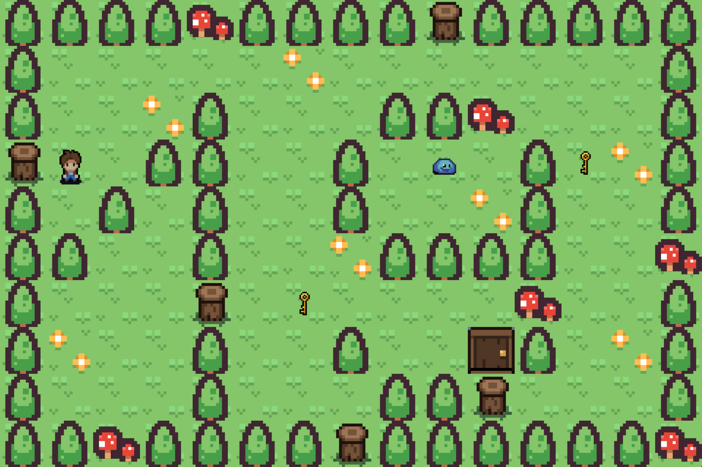

<h1 align="center">
	📖 So Long | 19 Brussels
</h1>

<p align="center">
	
	
	
	
	
</p>

## 💡 About the project

> This is a 42 School's project. The project consists in creating a little 2D game with the MiniLibX, the school's graphic library.
> I decided to use some classic rpg sprites which kinda gives "The legend of Zelda" vibes.

## ⚔️ The game
>In order to complete the game, players must avoid all enemies and acquire all of the collectibles on the map before taking the exit. ennemies can be vanquished by using your sword.


<h2 align="center">
	Running Game
</h2>

```bash
./so_long [MAP.ber]
```

------------

| HOW TO PLAY  |   |
| ------------ | ------------ |
|  Z | Move up ⬆️|
|  Q | Move left ⬅️|
|  S | Move down ⬇️|
|  D | Move right ➡️|
|  F | Use your sword ⚔️|
|  ESC | Close the game ❌|
------------
<p>
	To be valid, a map must meet the following conditions :
	<ul>
		<li>be rectangular</li>
		<li>surrounded by walls</li>
		<li>contain only one starting position</li>
		<li>contain only one exit door</li>
		<li>contain at least one collectible</li>
		<li>Have a valid path</li>
	</ul>
</p>
